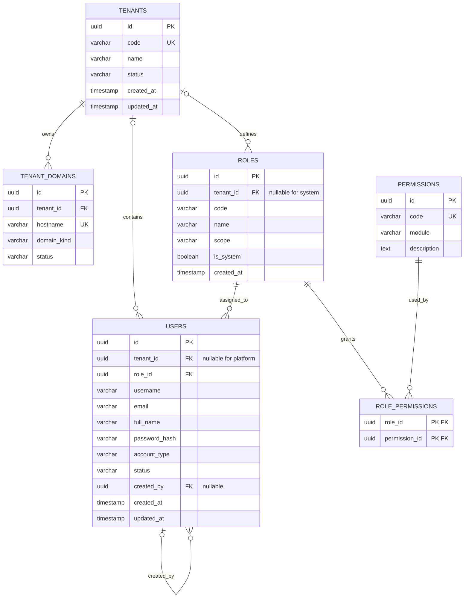

# User Management

```mermaid
erDiagram
    TENANTS {
        uuid id PK
        varchar code UK
        varchar name
        varchar status
        timestamp created_at
        timestamp updated_at
    }

    TENANT_DOMAINS {
        uuid id PK
        uuid tenant_id FK
        varchar hostname UK
        varchar domain_kind
        varchar status
    }

    USERS {
        uuid id PK
        uuid tenant_id FK "nullable for platform"
        uuid role_id FK
        varchar username
        varchar email
        varchar full_name
        varchar password_hash
        varchar account_type
        varchar status
        uuid created_by FK "nullable"
        timestamp created_at
        timestamp updated_at
    }

    ROLES {
        uuid id PK
        uuid tenant_id FK "nullable for system"
        varchar code
        varchar name
        varchar scope
        boolean is_system
        timestamp created_at
    }

    PERMISSIONS {
        uuid id PK
        varchar code UK
        varchar module
        text description
    }

    ROLE_PERMISSIONS {
        uuid role_id PK,FK
        uuid permission_id PK,FK
    }

    TENANTS ||--o{ TENANT_DOMAINS : owns
    TENANTS |o--o{ USERS : contains
    TENANTS |o--o{ ROLES : defines
    ROLES ||--o{ USERS : assigned_to
    ROLES ||--o{ ROLE_PERMISSIONS : grants
    PERMISSIONS ||--o{ ROLE_PERMISSIONS : used_by
    USERS |o--o{ USERS : created_by
```
